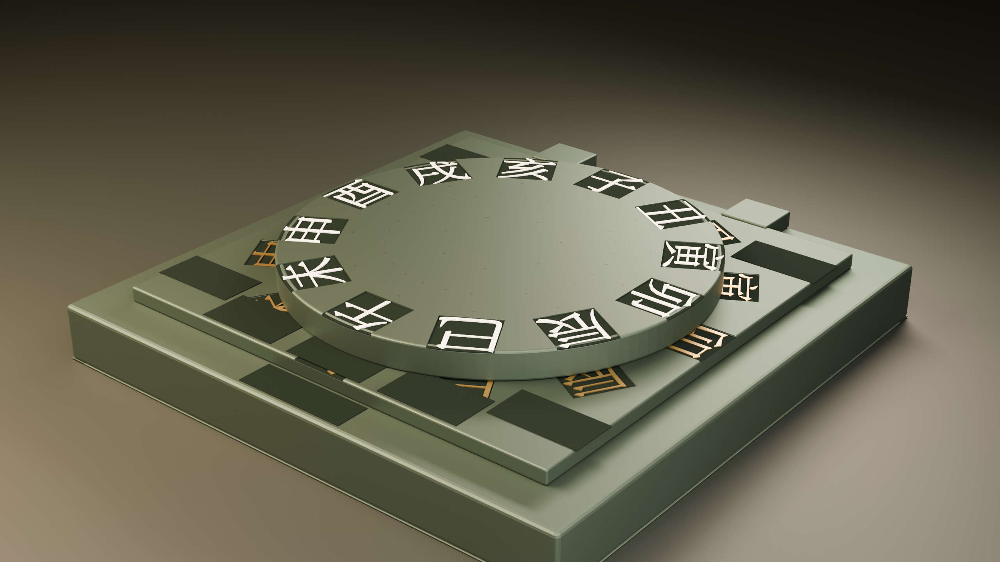
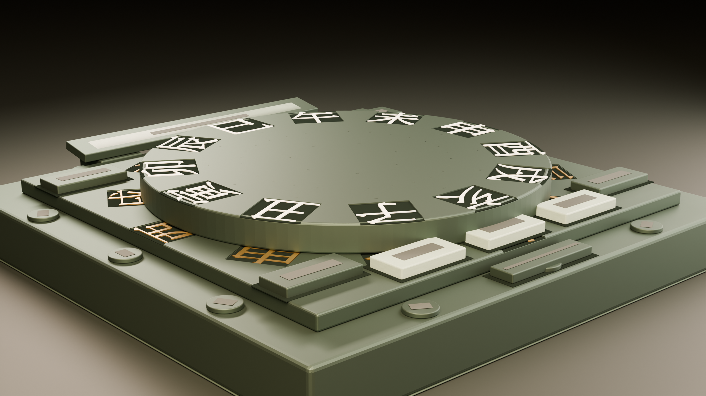
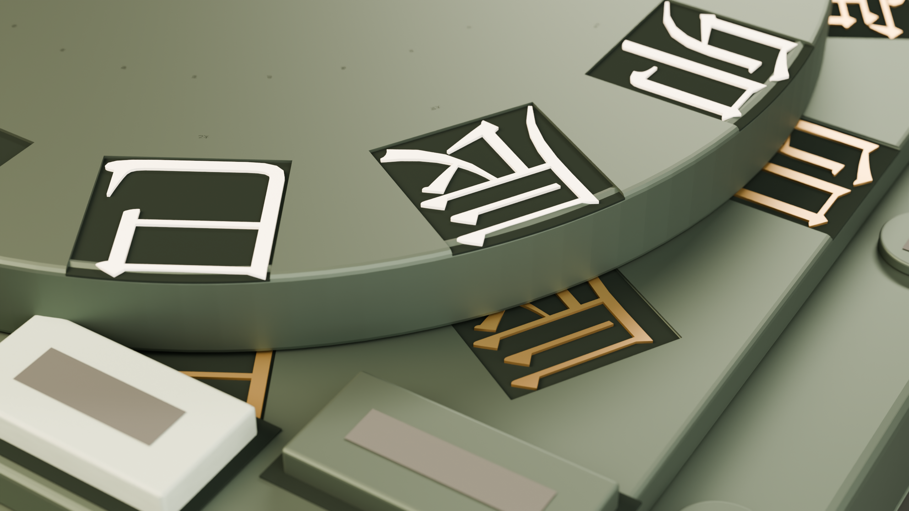
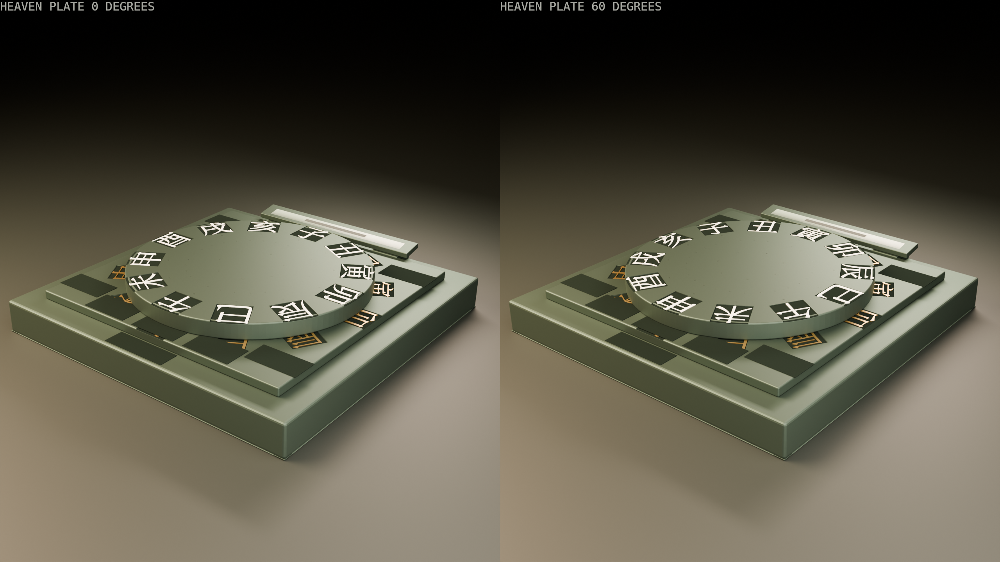
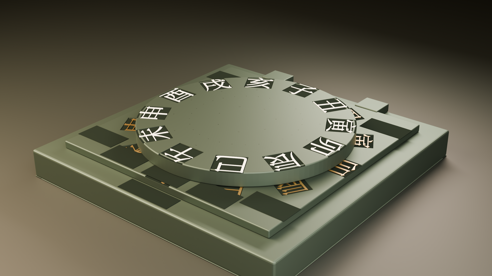

# Daliuren Artifact Lookdev Review

## Render manifest

- Blender: `4.5.12 LTS`
- Engine: `CYCLES`
- Samples: `64`, Cycles denoising enabled
- Color management: `AgX`, `AgX - Medium High Contrast`
- Lighting: fixed `4300 K` wide key, `40%` front fill, low rectangular rim
- Exposure: fixed `-1.0 EV` for every frame; no animated lights
- Resolution: `2560 x 1440` PNG, opaque background, bloom disabled

## Review frames

### overall

### oblique

### material-closeup

### rotation-evidence

### legibility

## Visual evidence

| Evidence | Frame | Result |
| --- | --- | --- |
| real edge thickness | overall / oblique | PASS — heaven/earth plate rims and every narrow lesson/transmission slip retain distinct side faces and grounded contact edges. |
| continuous moving highlight | rotation-evidence | PASS — the 0°/60° pair moves the heaven glyph ring and its broad rim highlight together while the earth plate and fixed rig do not move. |
| bronze/celadon reflection difference | material-closeup | PASS — warm gold earth glyphs, ash-white heaven glyphs, and muted celadon plates separate by hue, specular response, and roughness. |
| contact-driven wear | oblique / material-closeup | PASS — restrained brightening follows exposed rims and slip contact edges without flattening the broad celadon faces. |
| recess oxidation | oblique / material-closeup | PASS — dark recessed beds remain continuous behind both branch families with clean edges and no near-black fan artifact. |
| readable functional inscription | overall / material-closeup | PASS (mean=0.374, dark=0.018, contrast=10.05) |
| lower-contrast historical inscription | overall / material-closeup | PASS — the small historical marks remain subordinate to the bright 24 functional branch glyphs. |
| grounded contact shadow | overall / oblique | PASS — plate, slips, seats, buttons, and base all show contact shadows; no part reads as floating or coplanar. |

## SHA-256

| Artifact | SHA-256 |
| --- | --- |
| `assets/daliuren/source/daliuren-artifact-master.blend` | `bdf657cb63d06c743e2c136c53091c6530fbad0b8f26c193a17eac3dd0351a2e` |
| `public/models/daliuren/daliuren-artifact-lod0.glb` | `f3860779e53ab0a3419870f873a241836dcb61d582b99ad325a663035fe2d116` |
| `public/models/daliuren/daliuren-artifact-lod1.glb` | `2ff55e9f2dc488fe809247d6c56478cb77b1709fce3ad9481156601fb2745213` |
| `public/models/daliuren/daliuren-artifact-lod2.glb` | `3e7a7fa918391065fadaab66c7f959b5a3094ecb4c0b4901d3d495c2068862f6` |
| `docs/asset-reviews/lookdev/overall.png` | `8252860e95d5939a30bb9f077bcf4e28b3a4613c3b6395458a37657f0a96caec` |
| `docs/asset-reviews/lookdev/oblique.png` | `2819fc3a4df192cec30fd1859e0fbe1626c687a7686d412cf878fe7903554d81` |
| `docs/asset-reviews/lookdev/material-closeup.png` | `a4b5caff96fdcdccc865932b5f76aebd25d5be716085d86eaa6073e7bfed4313` |
| `docs/asset-reviews/lookdev/rotation-evidence.png` | `a1f0d1b873fed9913ff550737b09ab7e0b67298760e2cd2228108c8ad22866b8` |
| `docs/asset-reviews/lookdev/legibility.png` | `cc73bd5df14772ccae19843657e35503b1eb048747dce749e6063e7d2af65114` |
